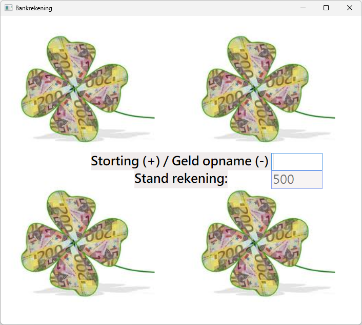
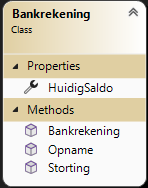

# Oefening 7 - KlasseBankrekening

De stortingen of geldopnames worden afgesloten door de return toets. Zorg er ook voor dat je enkel cijfers kan ingeven. Schrijf een voidprocedure BedragVerhogen() en een voidprocedure BedragVerminderen() die de klasse oproepen.

