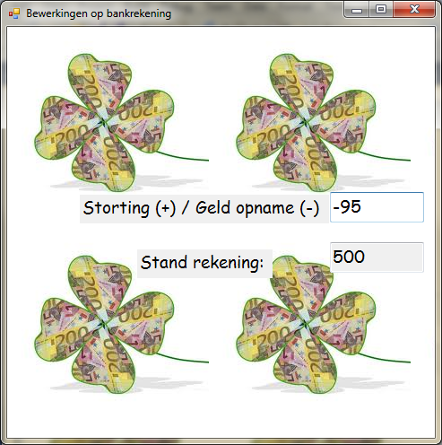
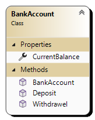

# KlasseBankrekening



Schrijf een toepassing waarin je stortingen en geldopnames mee kan doen.
- Gebruik een TextBox waarmee de gebruiker een bedrag kan ingeven
- Zorg ervoor dat je enkel cijfers kan ingeven.
- De stortingen of geldopnames worden afgesloten door de return toets in te drukken.
- Maak voor de logica een klasse aan: ```BankAccount```
- Schrijf een voidprocedure *IncreaseAmount*() en een voidprocedure *DecreaseAmount*() in de klasse *BankAccount* en zorg dat die correct aangeroepen worden.

